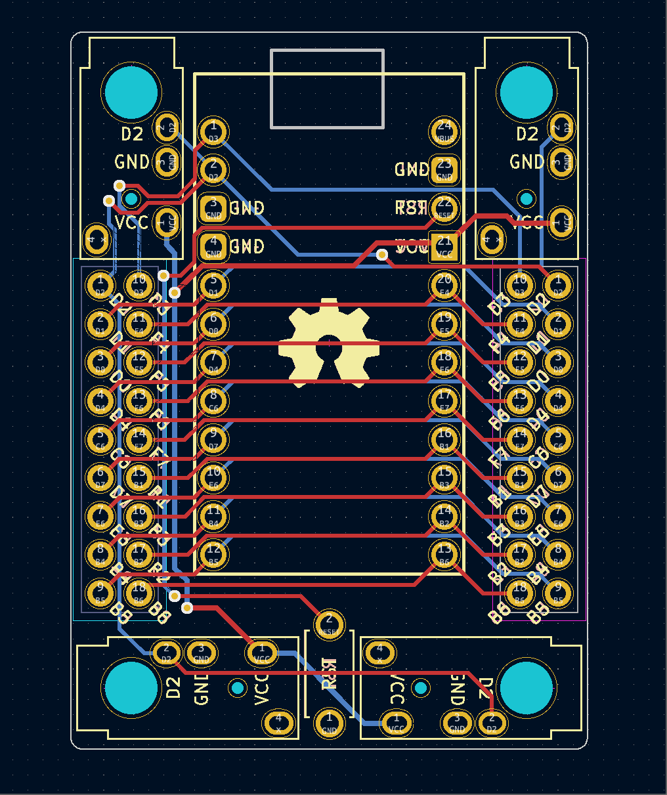

# Handwiring Microboard

## Description

Handwiring Microboard is a board fits 12x2 pins Microboard (like Pro Micro, Sea Picro etc...) for any opensource board. It expanded 4 M2 screws holes, one version supported 7 columns and 5 rows pins spilt keybaord (2 different direction TRRS jeck pins on board); one version supported all pins used for board non-split. 