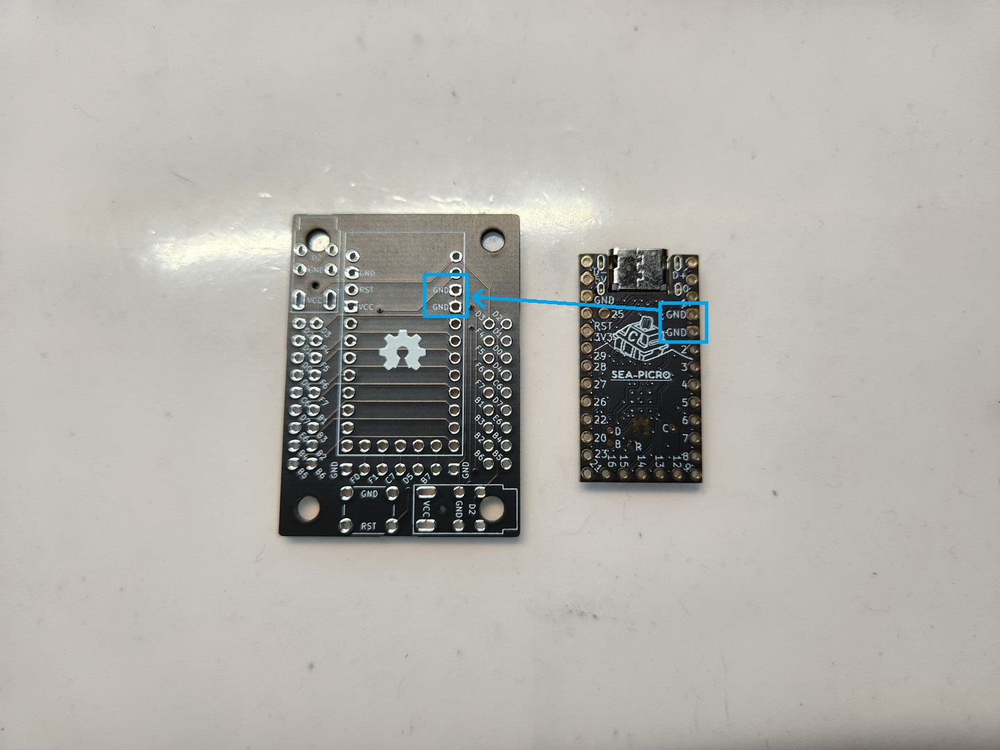
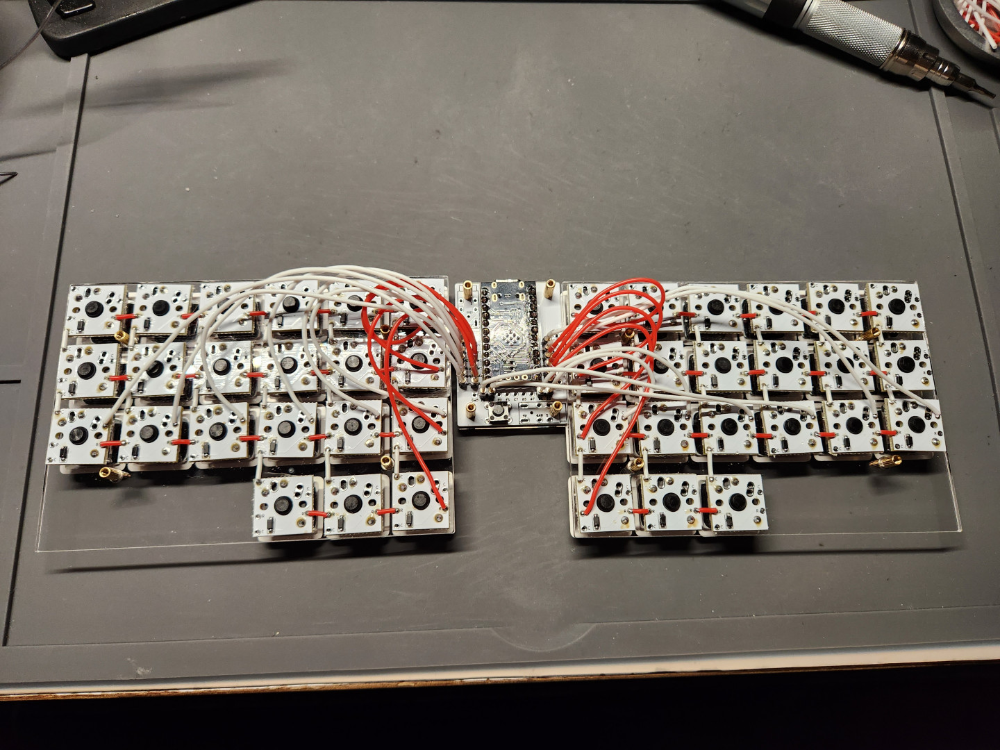

# Handwiring Microboard 手拉線拓展板

## 詳細說明

Pro Micro、Elite-C是大部分開源分離式鍵盤使用的MCU，左右為12+12的針腳數，特別是Elite-C在Pro Micro的腳位上多增加了5個可用的針腳數，增加鍵盤的可能性。礙於開發板本身是不帶螺絲孔位，因此設計了這個將所有Pro Micro可用的針腳及Elite-C多拓展的5個針腳拉出來統合在一起的拓展板，更方便製作鍵盤。

- 支援正反面安裝，MCU需對照腳位焊接。
- 支援2個不同方向的TRRS座安裝。
- 4個ø3.4mm直徑的螺絲孔位。

## 大小規格

- 螺絲孔大小: `ø3.4 mm.`
- 拓展板大小: `34.084 x 47.310 mm`
- M2螺絲孔間距: `26.08 mm`, `39.307 mm`

## 板載使用的針腳

- 重複設計了大約4次，前2次計算針腳的數量錯誤；
- 第3次在實際安裝的時候發現會有一些技術上的安裝問題；
- 最後一次設計將18個可編程的Pro Micro針腳做對稱處理，不用再擔心會有安裝上的技術問題。

### Elite-C:

使用Elite-C腳位的MCU，板子上所有的針腳位都可以使用，請依照拓展板上的針腳代號進行編程。

### Pro Micro:

如果使用Pro Micro進行安裝，拓展板上最下方的5個拓展針腳是無法使用的，請特別留意。

## 如何安裝

> **Warning**
>
> 手拉線拓展板正反面皆可安裝，請特別留意MCU上方標示的針腳，必需和拓展板上的針腳相同。

> **Warning**
>
> 如需使用到TRRS座，則會犧牲`一組M2螺絲孔位`。

## 如何使用

### A、3D模型設計及繪製

> **Note**
>
> 請善用手拉線拓展板的`step`檔案進行3D鍵盤模型的繪製，即可定位拓展板的位置。

### B、手拉線：

> **Note**
>
> 請搭配`單格電路板`、`THT直插式二極體`、`電線`及`鍵軸`做使用。

### C、繪製可支援拓展板的鍵盤PCB：

> **Note**
>
> 在鍵盤電路板上設計一個`2x9`、`2.54mm間距`的雙排排針焊盤，以支援手拉線拓展板。

## 參考資料及使用說明

- JLCPCB。
- KiCAD version `7.05`。
- Fusion360。
- `Pro Micro`、`Elite-C`、`Micro Pico`、`Sea Picro`。