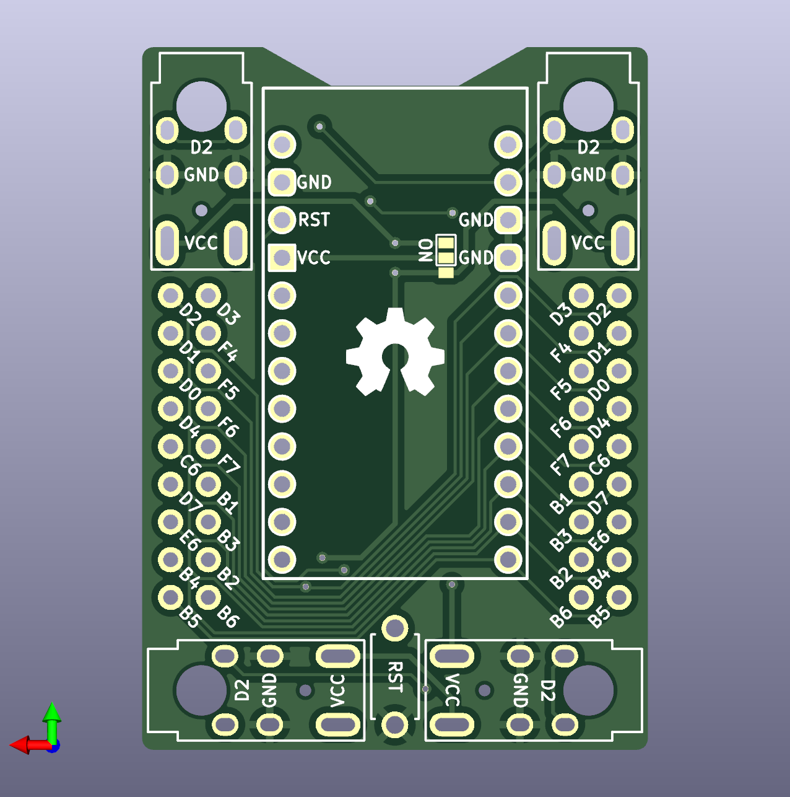

# Handwiring Microboard 手拉線拓展板

## Description

Handwiring Microboard is a board used Elite-C 12+12+5 pins to expand. It can use on opensource kayboard for split, non-split, ANSI layout; Supported Max matrix 17 columns, 6 rows keyboard.

- TRRS jeck have 2 directions can install.
- Turn to back side change different install way.
- 4 M2 screws holes supported.

## Length and Weight

- M2 holes: `ø2.2 mm.`
- Size of microboard: `34.020 x 46.992 mm`
- Distance between M2 holes: `25.697 mm`, `38.945 mm`

## Microboard Expanded Pin Used

First design used pro micro pins, but the board only supported split keyboard and numpad, so I change idea to Elite-C, it have 5 more pins than pro micro, then final design supported max matrix 16 columns and 6 rows. This size of matrix is same as 80% TKL keyboard.

### Elite-C:

This is the pins uesd:

- Row0-5: 
`{ F6, F7, B1, B3, B2, B6 }`

- Column0-17:
`{ D0, D4, C6, D7, E6, B4, B5, D2, D3, D1, B7, D5, C7, F1, F0, F4, F5 }` 

### Pro Micro:

If you are not using Elite-C install the board, so you only have `Row0-5` and `Column0-6` pins can used.

- Row0-5: 
`{ F6, F7, B1, B3, B2, B6 }`

- Column0-6:
`{ D0, D4, C6, D7, E6, B4, B5 }` 

## How to Use Handwiring Microboard