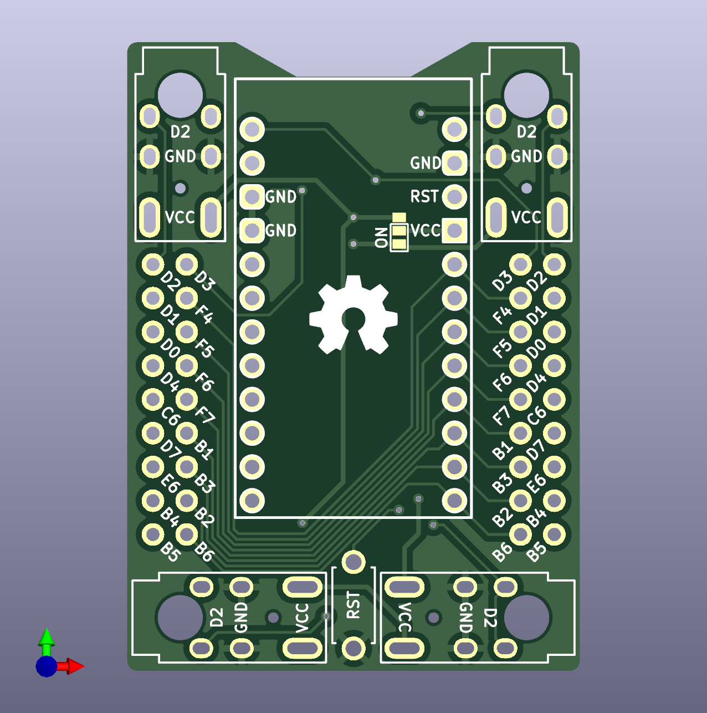
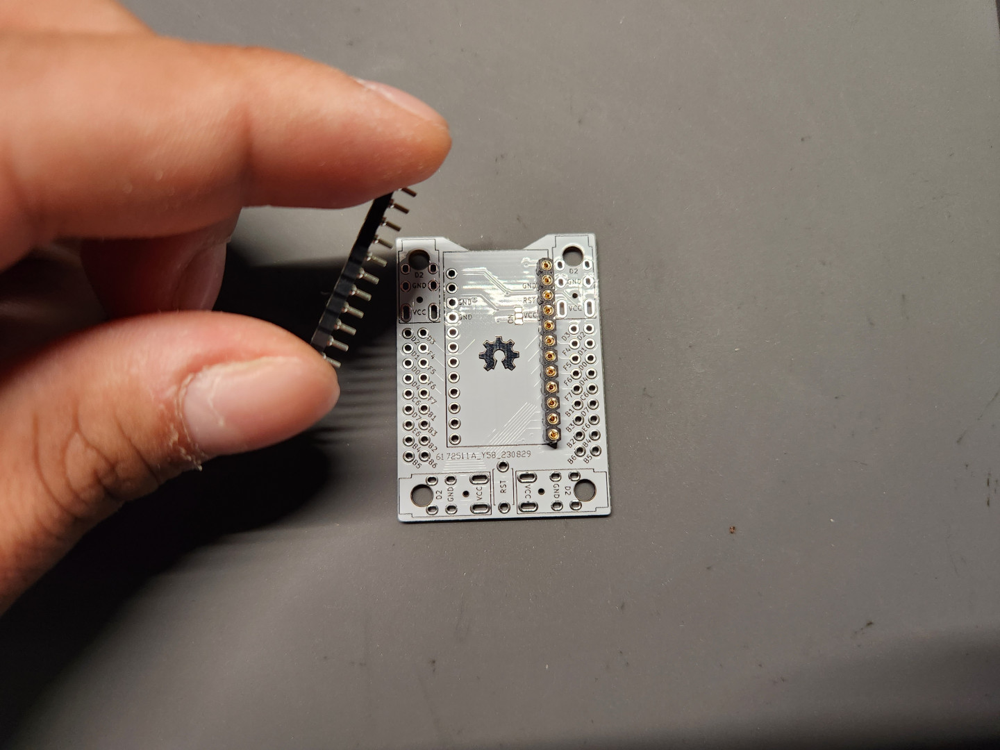
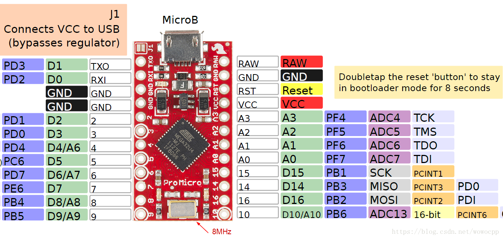

# Handwiring Microboard 手拉線拓展板

|||
|--|--|
||||

## 詳細說明

在開源鍵盤的世界裡，Pro Micro、Elite-C等是最為常用的開發板，搭載客製化鍵盤很常見的ATMega32U4晶片，其腳位都為12+12 pin的設計。然而開發板本身是不帶螺絲孔位的，因此大部分的鍵盤開發者會將Pro Micro或Elite-C的footprint直接設計在鍵盤的PCB上，再對照韌體使用的Pin腳，連結鍵盤所需的矩陣及元件。

而手拉線拓展板就是為了解決這個問題而設計的，特色如下：

- 支援`正反面`MCU安裝。
- 集中MCU可編程的`18個pin腳`於左右兩側做對稱處理，可左右翻轉做安裝。
- 支援TRRS座`雙面安裝`，可安裝在`4個角落`位置、4個方向。
- 角落有4個`ø3.4mm`的螺絲孔位，可通過`M2`規格的`黃銅銅柱`。

## 使用方式

### A、使用材料

|零件名|數量|備註|
|--|--|--|
|電路板（`PCB`）|1片、2片|一體式、分離式|
|`2pin` 輕觸開關|1個||
|`MCU`|1個、2個|分離式鍵盤需用到2片|
|`TRRS座`|2個|分離式鍵盤用|
|單排排針|`9pin`、`12pin`||
|公母圓排針|`9pin`、`12pin`|推薦|

### B、安裝方式

#### a、一體式

- 首先準備好`PCB`、`MCU`、`2pin輕觸開關`。


- 接著對好MCU上的`腳位`進行焊接安裝。


> **Note**
>
> MCU晶片朝下、朝上都可以安裝在手拉線拓展板上，對好板子上及MCU上的腳位即可。

- 這裡使用`公母圓排針`進行示範安裝。將公圓排針準備好，切正確的大小安裝到MCU上。


- 接著將MCU上的排針焊接完成。


- 再來將`母排針座`安裝到拓展板上。



- 接著從背面焊接固定`母排針座`。


- 再將MCU安裝到拓展板上。


- 接著將`2pin輕觸`開關安裝上去焊接固定。


- 完成後會是這樣的感覺。


> **Note**
>
> 如果你的鍵盤是一體式設計，接著將韌體燒錄進MCU後，就可以使用了。

#### b、分離式

> **Note**
>
> 如果你的鍵盤設計屬分離式，那麼請繼續看下去。

- 接著將已經焊接好MCU的手拉線拓展板跟`TRRS座`準備好。


> **Warning**
>
> TRRS座有4個位置可以安裝選擇，請選一個自己想要的位置安裝。


- 接著將`TRRS座`焊接固定好。


- 焊接好之後翻至`背面`，接著將背面的`跳線ON`的部分焊接起來。


- 跳線焊接好後會是這樣。


> **Warning**
>
> 跳線連接的方式會依照MCU朝上、朝下安裝方式的不同而有差異，務必留意。

- 接著準備好左右邊鍵盤的手拉線拓展板，將韌體燒錄到左右邊，再接上`TRS`/`TRRS線`測試鍵盤即可使用。


## 注意事項

> **Warning**
>
> `MCU`、`TRRS座`、`2pin輕觸開關`務必安裝在`同一側`，以免拓展板失靈。

> **Note**
>
> 拓展板支援`Pro Micro`、`Elite-C`等`12+12 pin`的MCU。

> **Warning**
>
> 如使用`Micro Pico`等`RP2040`等MCU，請依照下表進行`IO pin`的轉換。（以`Sea-Picro`為例）

|Pro Micro|Elite-C|Sea-Picro|
|--|--|--|
||||

- IO Pin對照表：

|**Pro Micro、Elite-C左側**|**Pico左側**|**Pro Micro、Elite-C右側**|**Pico右側**|
|--|--|--|--|
|-|`D+`|`VBUS`|`D-`|
|`D3`|`GP0`|`B0`|`RAW`|
|`D2`|`GP1`|`GND`|`GND`|
|`GND`|`GND`|`RST`|`RST`|
|`GND`|`GND`|`VCC`|`3V3`|
|`D1`|`GP2`|`F4`|`GP29`|
|`D0`|`GP3`|`F5`|`GP28`|
|`D4`|`GP4`|`F6`|`GP27`|
|`C6`|`GP5`|`F7`|`GP26`|
|`D7`|`GP6`|`B1`|`GP22`|
|`E6`|`GP7`|`B3`|`GP20`|
|`B4`|`GP8`|`B2`|`GP23`|
|`B5`|`GP9`|`B6`|`GP21`|
|**Elite-C下方**|**Pico下方**|--|--|
|`B7`|`GP12`|--|--|
|`D5`|`GP13`|--|--|
|`C7`|`GP14`|--|--|
|`F1`|`GP15`|--|--|
|`F0`|`GP16`|--|--|

> **Note**
>
> 如鍵盤要將手拉線拓展板設計到鍵盤內，請使用step檔進行3D模型的設計。

拓展板規格如下：
- 螺絲孔大小: `ø3.4 mm.`
- 拓展板大小: `34.084 x 47.310 mm`
- M2螺絲孔間距: `26.08 mm`, `39.307 mm`

> **Warning**
>
> `TRRS座`預設使用`D2/GP1`進行左右邊鍵盤的資料傳輸，請務必留意。

```
#define SOFT_SERIAL_PIN [D2/GP1]
```

## 參考資料及使用說明

- JLCPCB。
- KiCAD version `7.05`。
- Fusion360。
- `Pro Micro`、`Elite-C`、`Micro Pico`、`Sea Picro`。